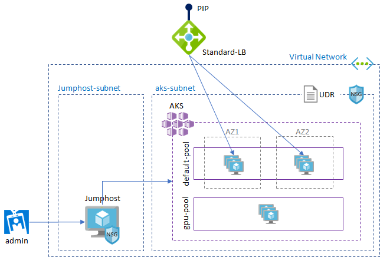

# README

> Script works with Terraform `v0.12.10`. You may need to upgrade the scripts if you want to use `v0.12.12`

Sample terraform script for AKS.

## Sample architecture



AKS deployment architecture with advanced features.
- [Advanced networking (Azure CNI)](https://docs.microsoft.com/en-us/azure/aks/configure-azure-cni)
- [Autoscale](https://docs.microsoft.com/en-us/azure/aks/cluster-autoscaler) (preview)
- [Multi-node pools](https://docs.microsoft.com/en-us/azure/aks/use-multiple-node-pools) (preview)
- [Availability Zones](https://docs.microsoft.com/en-us/azure/aks/availability-zones) (preview)

You need to set `load_balancer_sku = "standard"` in `network_profile` in order to use __AZ__.

> Note: At the time of writing this, you need to manually register preview features in order to use __multi-node pools__ and __AZ__. See documentation for more information


## Run Terraform

Sample AKS terraform script is located in [aks](./aks) folder.

> Please refer [README](./README.md) for how to run terraform script.

## Test

Once create AKS cluster, run following CLI to get K8S config key

```
az aks get-credentials --resource-group $rgname --name $aksname
```

### Run sample images

Run a sample image for test. Please refer [terraform examples](https://github.com/terraform-providers/terraform-provider-azurerm/tree/master/examples/kubernetes) for more information

```
kubectl apply -f aks\files\demo.yaml
```

### Browse K8S dashboard

```
az aks browse --resource-group $rgname --name $aksname
```

> You need to run following CLI to access dashboard. `#kubectl create clusterrolebinding kubernetes-dashboard --clusterrole=cluster-admin --serviceaccount=kube-system:kubernetes-dashboard`

## Run GPU workload

To run GPU workload, please refer [AKS GPU cluster documentation](https://docs.microsoft.com/en-us/azure/aks/gpu-cluster) for more information
